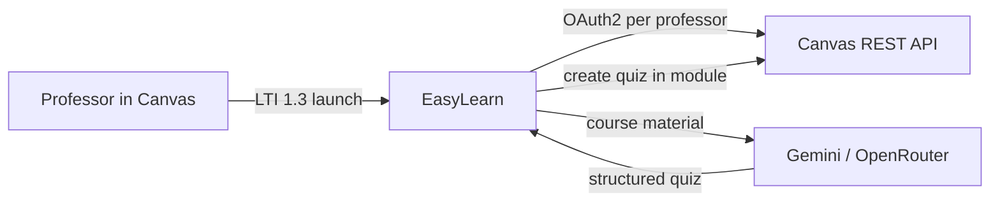

# EasyLearn

EasyLearn is a Canvas LTI 1.3 web application that generates structured quizzes
from course materials (PDF/PPTX) using configurable AI models, then deploys them
back into Canvas. Each professor launches from their course, authorizes with their
own Canvas account, and works within their permissions.

---

## Quickstart (Docker)

### Prerequisites

- Docker and Docker Compose
- A Canvas instance you administer
- RSA keypair in `keys/` (see below)
- `config/lti_config.json` (copy from [config/lti_config.example.json](./config/lti_config.example.json))

### 1. Configure

```bash
cp .env.example .env
cp config/lti_config.example.json config/lti_config.json
# Edit both files — see docs/canvas-setup.md
```

Minimal `.env` variables:

| Variable | Purpose |
|----------|---------|
| `CANVAS_API_URL` / `CANVAS_PUBLIC_URL` | Canvas (API + browser) |
| `EASYLEARN_PUBLIC_URL` | This app’s public URL |
| `CANVAS_API_TOKEN` | Admin token for CLI setup only |
| `CANVAS_CLIENT_ID` / `CANVAS_CLIENT_SECRET` | OAuth API key |
| `GEMINI_API_KEY` | Quiz generation |
| `SESSION_SECRET_KEY` | Cookie encryption |

Automate OAuth key creation:

```bash
uv sync
uv run utils/configure_oauth.py --write-env
uv run utils/configure_lti.py
```

### 2. LTI keys

```bash
mkdir -p keys
openssl genrsa -out keys/private.key 2048
openssl rsa -pubout -in keys/private.key -out keys/public.key
```

### 3. Run

```bash
docker compose up -d --build
```

With Cloudflare Tunnel (set `TUNNEL_TOKEN` in `.env`):

```bash
docker compose --profile tunnel up -d --build
```

Verify:

```bash
uv run utils/check_setup.py
curl -s https://easylearn.example.com/api/session
```

Launch EasyLearn from a Canvas course as a **teacher** to authorize and use the dashboard.

---

## How it fits together



Canvas uses **two Developer Keys**: LTI (launch identity) and OAuth (per-professor API
access). Details: [docs/lti-and-oauth.md](./docs/lti-and-oauth.md).

---

## Documentation

| Doc | Contents |
|-----|----------|
| [docs/canvas-setup.md](./docs/canvas-setup.md) | Canvas instance, Developer Keys, LTI config |
| [docs/deployment.md](./docs/deployment.md) | Docker, Cloudflare Tunnel, production checklist |
| [docs/lti-and-oauth.md](./docs/lti-and-oauth.md) | Launch flow, cookies, token refresh |
| [docs/cli.md](./docs/cli.md) | `utils/` command reference |
| [docs/architecture.md](./docs/architecture.md) | Code map and request lifecycle |
| [docs/demo.md](./docs/demo.md) | End-to-end demo runbook |

---

## Local development (without Docker)

```bash
uv sync
cp .env.example .env   # fill in values
uv run utils/check_setup.py
uv run main.py           # http://0.0.0.0:8000
```

Use the same `.env` for both Docker and bare-metal runs.

---

## License

See repository license file.
