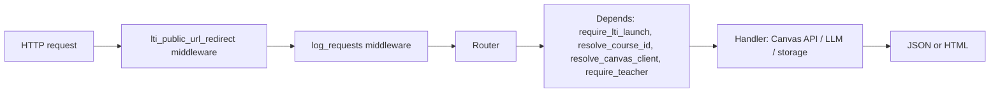
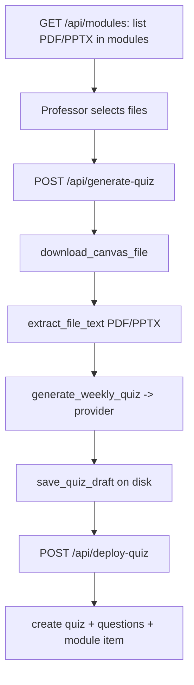

# Architecture

EasyLearn is a FastAPI application that bridges Canvas (auth + course data) and
an LLM (quiz generation). This document maps the codebase and the request flow.
For the auth/launch model see [lti-and-oauth.md](./lti-and-oauth.md).

---

## Module map

| Path | Responsibility |
|------|----------------|
| [main.py](../main.py) | App entrypoint: middleware, session config, exception handlers, router registration |
| [app/routers/lti_routes.py](../app/routers/lti_routes.py) | `/login`, `/launch`, `/jwks` |
| [app/routers/oauth.py](../app/routers/oauth.py) | `/oauth/login`, `/oauth/callback` |
| [app/routers/pages.py](../app/routers/pages.py) | `/` dashboard, favicon |
| [app/routers/api.py](../app/routers/api.py) | `/api/*` JSON endpoints |
| [app/dependencies.py](../app/dependencies.py) | `Depends()` helpers: course id, Canvas client, role gating |
| [app/auth.py](../app/auth.py) | OAuth mode, session snapshot, public URL helpers |
| [app/canvas_oauth.py](../app/canvas_oauth.py) | OAuth token exchange, refresh, session storage |
| [app/canvas.py](../app/canvas.py) | Canvas API client + file download |
| [app/canvas_courses.py](../app/canvas_courses.py) | Course listing, teacher checks, quiz API helpers |
| [app/lti.py](../app/lti.py) | `pylti1p3` FastAPI adapter (request, cookies, OIDC, launch) |
| [app/lti_config.py](../app/lti_config.py) | `tool_conf` singleton from `config/lti_config.json` |
| [app/config.py](../app/config.py) | All environment variables (single source of truth) |
| [app/extraction.py](../app/extraction.py) | PDF/PPTX text extraction |
| [app/generation.py](../app/generation.py) | Quiz prompt + LLM dispatch |
| [app/course_gen.py](../app/course_gen.py) | AI demo-course outline generation |
| [app/llm/](../app/llm/) | Model catalog, provider adapters (Gemini/OpenRouter), error mapping |
| [app/deployment.py](../app/deployment.py) | Create quiz + questions + module link in Canvas |
| [app/storage.py](../app/storage.py) | Quiz drafts + module cache on disk |
| [app/schemas.py](../app/schemas.py) | Pydantic models |
| [utils/](../utils/) | CLI tools (setup doctor, LTI config, course/user generation) |

---

## Request lifecycle

Middleware (registered in [main.py](../main.py)):

- `lti_public_url_redirect` — redirects `/login`, `/launch`, `/jwks` from
  `localhost` to `EASYLEARN_PUBLIC_URL` so the OIDC handshake stays on one host.
- `log_requests` — structured request logging.
- `SessionMiddleware` — encrypted session cookie; `same_site`/`https_only`
  derived from the Canvas scheme in [app/config.py](../app/config.py).

Exception handlers:

- `InvalidAccessToken` — attempts a one-shot OAuth refresh, otherwise clears the
  token and prompts re-authorization.

---

## Dependencies and role gating

`/api/*` handlers compose three injectables from
[app/dependencies.py](../app/dependencies.py):

- `resolve_course_id` — numeric course id from the LTI session (`canvas_course_id`).
- `resolve_canvas_client` — Canvas client from the session OAuth token
  (refreshed proactively).
- `require_teacher` — allows teaching roles, rejects students with `403`.

`validate_course_access` additionally confirms teacher enrollment against Canvas
for course-scoped actions (e.g. switching courses).

---

## Quiz generation pipeline

Generation routes to a provider based on the model catalog
[config/ai_models.json](../config/ai_models.json) via
[app/llm/registry.py](../app/llm/registry.py). Each model entry declares its
`provider` (`gemini` or `openrouter`), model string, and structured-output mode.
Models whose provider API key is missing appear disabled in the dashboard.

---

## Storage

[app/storage.py](../app/storage.py) persists to `cache/`:

- Quiz drafts — per course (not per user).
- Downloaded Canvas files and the module list cache.

`cache/` is gitignored and treated as confidential (course material + drafts).

---

## Scaling constraint (single process)

The LTI launch state uses `InMemoryDataStorage` in [app/lti.py](../app/lti.py),
which lives in one process's memory. Do **not** run multiple Uvicorn workers or
replicas without first replacing it with shared storage (e.g. Redis), or
launches will intermittently fail. `FastAPIRequest.is_secure()` honors
`X-Forwarded-Proto`, so a TLS-terminating reverse proxy must forward it — see
[deployment.md](./deployment.md).
