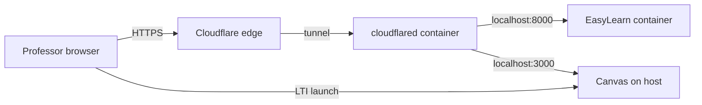

# Deployment

EasyLearn runs as a Docker container. Canvas is deployed separately (self-hosted
or cloud); this guide covers EasyLearn + optional Cloudflare Tunnel exposure.

---

## Topology



| Public hostname | Typical origin (tunnel ingress) |
|-----------------|--------------------------------|
| `canvas.example.com` | `http://localhost:3000` |
| `easylearn.example.com` | `http://localhost:8000` |

The tunnel service uses **host networking** so Zero Trust ingress rules pointing
at `localhost` keep working without changes.

---

## Docker Compose

```bash
cp .env.example .env
# Fill CANVAS_* URLs, SESSION_SECRET_KEY, GEMINI_API_KEY, OAuth credentials
# Run: uv run utils/configure_oauth.py --write-env

docker compose up -d --build
docker compose logs -f easylearn
```

### Cloudflare Tunnel profile

1. Create a tunnel in Zero Trust → Networks → Tunnels → Install connector.
2. Add `TUNNEL_TOKEN=<token>` to `.env`.
3. Start:

```bash
docker compose --profile tunnel up -d --build
# Or set COMPOSE_PROFILES=tunnel in .env for a single `docker compose up`
```

Tunnel ingress origins must use **`http://`** (not `https://`) for local services.

---

## Environment variables

See [.env.example](../.env.example). Production minimum:

| Variable | Required | Notes |
|----------|----------|-------|
| `CANVAS_API_URL` | yes | Canvas REST base URL |
| `CANVAS_PUBLIC_URL` | yes | Browser-facing Canvas URL |
| `EASYLEARN_PUBLIC_URL` | yes | This tool’s public URL |
| `CANVAS_API_TOKEN` | yes | Admin token — **CLI only**, not used by the web app |
| `CANVAS_CLIENT_ID` / `SECRET` | yes | OAuth API Developer Key |
| `CANVAS_OAUTH_REDIRECT_URI` | yes | `{EASYLEARN_PUBLIC_URL}/oauth/callback` |
| `GEMINI_API_KEY` | yes* | *Or `OPENROUTER_API_KEY` |
| `SESSION_SECRET_KEY` | yes | Strong random hex |
| `TUNNEL_TOKEN` | tunnel | Cloudflare connector token |

Optional: `CANVAS_OAUTH_SCOPES` (only when OAuth key enforces scopes),
`GEMINI_MODEL`, `OPENROUTER_*`, `EASYLEARN_PORT`.

---

## Volumes and secrets

| Host path | Container | Purpose |
|-----------|-----------|---------|
| `./keys/` | `/app/keys` (ro) | LTI RSA keypair |
| `./config/lti_config.json` | `/app/config/lti_config.json` (ro) | LTI registration |
| `./cache/` | `/app/cache` | Quiz drafts, downloads |

Never bake secrets into the image. `.env` is loaded via `env_file`.

---

## HTTPS cookies

When `CANVAS_API_URL` is `https://`, [app/config.py](../app/config.py) sets
`SESSION_SAME_SITE=none` and secure cookies — required for Canvas cross-site POST
to `/launch`.

---

## Smoke tests

```bash
uv run utils/check_setup.py
curl -sI https://easylearn.example.com/jwks
curl -s https://easylearn.example.com/api/session
```

Launch from Canvas as a course teacher; complete OAuth; generate a quiz.

---

## External Canvas configuration

If Canvas runs in a separate repo (e.g. `canvas-lms` docker compose):

- Set Canvas `domain.yml` to your public hostname.
- Add the hostname to `ADDITIONAL_ALLOWED_HOSTS` in Canvas’s compose override.
- Run `uv run utils/configure_lti.py` after URL changes.

See [docs/canvas-setup.md](./canvas-setup.md).
