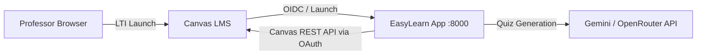

# EasyLearn — DevOps Deployment Guide

This guide covers deploying **EasyLearn** (an LTI 1.3 web application for Canvas LMS) via Docker Compose or bare-metal Python, along with registering the required Developer Keys in Canvas LMS.

---

## 1. Architecture & Deployment Topology



EasyLearn operates as a standalone LTI 1.3 web app. Instructors launch EasyLearn from Canvas course navigation, authorize access via OAuth2, select course module materials (PDF/PPTX), generate quizzes via AI providers, and deploy them back to Canvas.

---

## 2. Server Requirements & Environment Setup

### Environment Variables (`.env`)

Copy `.env.example` to `.env` and configure your instance:

```ini
# Base URLs
CANVAS_API_URL=https://canvas.example.com
CANVAS_PUBLIC_URL=https://canvas.example.com
EASYLEARN_PUBLIC_URL=https://easylearn.example.com

# Canvas Admin Token (Used for setup helpers only)
CANVAS_API_TOKEN=your_canvas_admin_token

# Canvas OAuth Credentials (Per-Professor REST API Access)
CANVAS_CLIENT_ID=your_canvas_api_key_client_id
CANVAS_CLIENT_SECRET=your_canvas_api_key_client_secret
CANVAS_OAUTH_REDIRECT_URI=https://easylearn.example.com/oauth/callback

# AI Provider Credentials (At least one required)
OPENROUTER_API_KEY=your_openrouter_api_key
GEMINI_API_KEY=your_gemini_api_key

# Session Security
SESSION_SECRET_KEY=generate_with_python_secrets_token_hex_32
```

---

## 3. Canvas Developer Key Configuration

EasyLearn requires **two** Developer Keys in Canvas: an **LTI 1.3 Key** for tool launching and an **API Key** for per-professor OAuth REST API access.

### 3a. Register LTI 1.3 Developer Key (Launch)

1. Log into Canvas as a Site Admin.
2. Navigate to **Admin** -> **Developer Keys** -> **+ Developer Key** -> **+ LTI Key**.
3. Configure the key:
   - **Key Name**: `EasyLearn`
   - **Redirect URIs**: `https://easylearn.example.com/launch`
   - **Target Link URI**: `https://easylearn.example.com/launch`
   - **OpenID Connect Initiation Url**: `https://easylearn.example.com/login`
   - **JWK Method**: **Public JWK URL** -> `https://easylearn.example.com/jwks`
   - **Placements**: **Course Navigation**
   - **Custom Fields**:
     ```text
     canvas_course_id=$Canvas.course.id
     ```
4. Save the key and toggle its state to **ON**.
5. Copy the generated numeric **Client ID**.
6. Install the App in Canvas (**Course Settings** or **Account Settings** -> **Apps** -> **Add App** -> **By Client ID**), then copy the **Deployment ID**.
7. Update `config/lti_config.json` with the Client ID, Deployment ID, and Canvas URLs:

```json
{
  "https://canvas.example.com": [
    {
      "default": true,
      "client_id": "<LTI_CLIENT_ID>",
      "auth_login_url": "https://canvas.example.com/api/lti/authorize_redirect",
      "auth_token_url": "https://canvas.example.com/login/oauth2/token",
      "key_set_url": "https://canvas.example.com/api/lti/security/jwks",
      "private_key_file": "../keys/private.key",
      "public_key_file": "../keys/public.key",
      "deployment_ids": ["<DEPLOYMENT_ID>"]
    }
  ]
}
```

### 3b. Register API / OAuth2 Developer Key (REST Access)

1. In Canvas, navigate to **Admin** -> **Developer Keys** -> **+ Developer Key** -> **+ API Key**.
2. Configure:
   - **Key Name**: `EasyLearn API`
   - **Redirect URIs**: `https://easylearn.example.com/oauth/callback`
3. Save, toggle **ON**, and copy the **Client ID** and **Client Secret** into your `.env` file as `CANVAS_CLIENT_ID` and `CANVAS_CLIENT_SECRET`.

---

## 4. Running the Application

### Docker Compose (Recommended)

```bash
# Generate RSA keypair for LTI signing if not already present:
uv run utils/configure_lti.py

# Start application
docker compose up -d --build
```

### Bare-Metal (with `uv`)

```bash
uv sync
uv run main.py
```

---

## 5. Health & Operability Endpoints

EasyLearn exposes standard health endpoints for container orchestrators and load balancers:

| Endpoint | Status Code | Role | Description |
|----------|-------------|------|-------------|
| `GET /healthz` | `200` | Liveness | Checks if application process is running. |
| `GET /readyz` | `200` or `503` | Readiness | Checks LTI RSA keys, `lti_config.json`, Canvas API URL, and AI provider key. |
| `GET /ops` | `200` / `303` / `404` | Operator dashboard | Spend, per-user usage, model health, recent LLM calls. Requires `OPS_ADMIN_TOKEN`. Disabled (404) when the token is unset. |

Set `OPS_ADMIN_TOKEN` and optionally `ALERT_WEBHOOK_URL` before using paid catalog models. The catalog lists named models only (`openrouter/free` is not used — it can route to weak models). Daily spend caps (`USER_DAILY_SPEND_USD`, `GLOBAL_DAILY_SPEND_USD`) block further LLM calls with HTTP 429. Usage is stored in `cache/ops/usage.db`.

---

## 6. Directory Structure & Persistent Storage

| Path | Container Path | Purpose |
|------|----------------|---------|
| `./keys/` | `/app/keys` | RSA keypair (`private.key`, `public.key`) for LTI signing |
| `./config/lti_config.json` | `/app/config/lti_config.json` | LTI tool registration config |
| `./cache/` | `/app/cache` | Downloaded module files, quiz drafts, and `ops/usage.db` (LLM spend ledger) |
